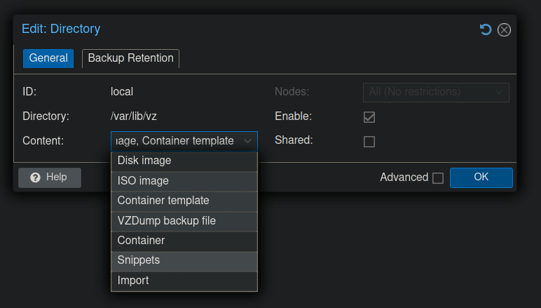

# talos-proxmox-cluster

[](https://github.com/Naman1997/talos-proxmox-cluster/actions/workflows/terraform.yml)
[](https://github.com/Naman1997/talos-proxmox-cluster/blob/main/LICENSE)

Automated talos cluster with system extensions

## Dependencies

| Dependency | Location |
| ------ | ------ |
| [Proxmox](https://www.proxmox.com/en/proxmox-ve) | Proxmox node |
| [xz](https://en.wikipedia.org/wiki/XZ_Utils) | Proxmox node |
| [jq](https://stedolan.github.io/jq/) | Client |
| [arp-scan](https://linux.die.net/man/1/arp-scan) | Client |
| [talosctl](https://www.talos.dev/latest/learn-more/talosctl/) | Client |
| [OpenTofu](https://opentofu.org/) | Client |
| [HAproxy](http://www.haproxy.org/) | Raspberry Pi |
| [Docker](https://docs.docker.com/) | Client |

`Client` refers to the node that will be executing `tofu apply` to create the cluster. The `Raspberry Pi` can be replaced with a VM or a LXC container.

Docker is mandatory on the `Client` as this projects builds a custom talos image with system extensions using the [imager](https://github.com/siderolabs/talos/pkgs/container/installer) docker image on the `Client` itself.

## Options for creation of HA Proxy Server

The `main` banch will automatically create a VM for a load balancer with 2 CPUs and 2 GiB of memory on your Proxmox node.

You can use the [no-lb](https://github.com/Naman1997/simple-talos-cluster/tree/no-lb) branch in case you do not want to use an external load-balancer. This branch uses the 1st master node that gets created as the cluster endpoint.

Another option is to use the [manual-lb](https://github.com/Naman1997/simple-talos-cluster/tree/manual-lb) branch in case you wish to create an external lb manually.

## Create the terraform.tfvars file

The variables needed to configure this script are documented in this [doc](docs/Variables.md).

```
cp terraform.tfvars.example terraform.tfvars
# Edit and save the variables according to your liking
vim terraform.tfvars
```

## Enable the Snippets feature in Proxmox

In the proxmox web portal, go to `Datacenter` > `Storage` > Click on `local` > `Edit` > Under `Content` choose `Snippets` > Click on `OK` to save.




## Create the cluster

```
tofu init -upgrade
tofu plan
tofu apply --auto-approve
```

## Expose your cluster to the internet (Optional)

It is possible to expose your cluster to the internet over a small vps even if both your vps and your public ips are dynamic. This is possible by setting up dynamic dns for both your internal network and the vps using something like duckdns
and a docker container to regularly monitor the IP addresses on both ends. A connection can be then made using wireguard to traverse the network between these 2 nodes. This way you can hide your public IP while exposing services to the internet.

Project Link: [wireguard-k8s-lb](https://github.com/Naman1997/wireguard-k8s-lb)


## Known Issue(s)

### Proxmox in KVM

Currently this only happens if you're running this inside on a proxmox node that itself is virtualized inside kvm. This is highly unlikely, but I'll make a note of this for anyone stuck on this.

This project uses `arp-scan` to scan the local network using arp requests. In case your user does not have proper permissions to scan using the `virbr0` interface, then the talos VMs will not be found.

To fix this, either you can give your user access to the interface by adding it to `libvirt`, `libvirt-qemu` and `kvm` groups or you can just use `sudo`, in case you opt for solution 2, make sure to run the `talosctl kubeconfig` command generated for you in `talos_setup.sh` after `tofu apply` finishes.